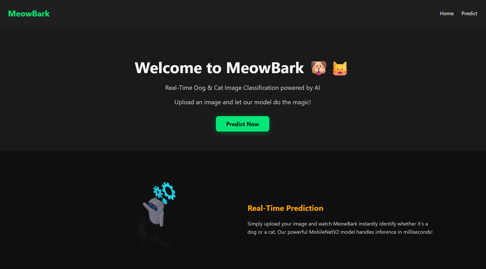
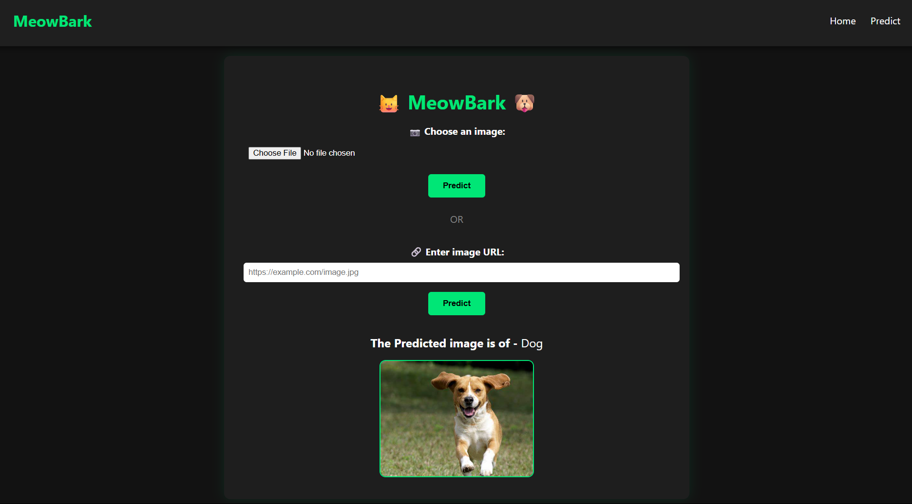

# 🐾 MeowBark – Cat vs Dog Image Classifier

**MeowBark** is a Flask-based web application that allows users to upload an image of a pet and instantly identify whether it’s a **cat** or a **dog** using a trained deep learning model built with TensorFlow and TensorFlow Hub.

---




## 🚀 Features

- 🖼️ Upload image via drag-and-drop or file input
- 🧠 Predict whether the image is of a cat or a dog using a trained model
- 🌙 Dark-themed UI with a sleek and simple design
- ⚙️ Built using Flask and TensorFlow

---

## 🛠️ Built With

- Python 3.x
- Flask
- TensorFlow / tf.keras
- TensorFlow Hub
- NumPy
- OpenCV
- HTML / CSS / JS

---

## 📦 Installation Instructions

```bash
# 1. Clone the repository
git clone https://github.com/yourusername/MeowBark.git
cd MeowBark

# 2. Create and activate a virtual environment
python -m venv venv

# On Windows
venv\Scripts\activate

# On macOS/Linux
source venv/bin/activate

# 3. Install the required dependencies
pip install -r requirements.txt

# 4. Add the environment variable which is listed in .env.example

# 5. Run the application
python app.py

MeowBark/
│
├── data/
│    ├── Dog Cat Image Resize
│    ├── kagglecatsanddogs_3367a
│
├── model/
│    ├── cat_dog_model.h5
│
├── notebook/
│    ├── MeowBark.ipynb
├── static/
│    ├── home.css
│   ├── style.css
│
├── templates/
│    ├── home.html
│   └── index.html
│
├── .env
├── .gitignore
├── app.py      
├── .Procfile
├── README.md
├── requirements.txt
├── runtime.tx

```
🧠 Model Details
The model (cat_dog_model.h5) is trained to classify between cat and dog images using a Convolutional Neural Network and a TensorFlow Hub feature extractor. The input image is resized to 224x224 and normalized before prediction.
